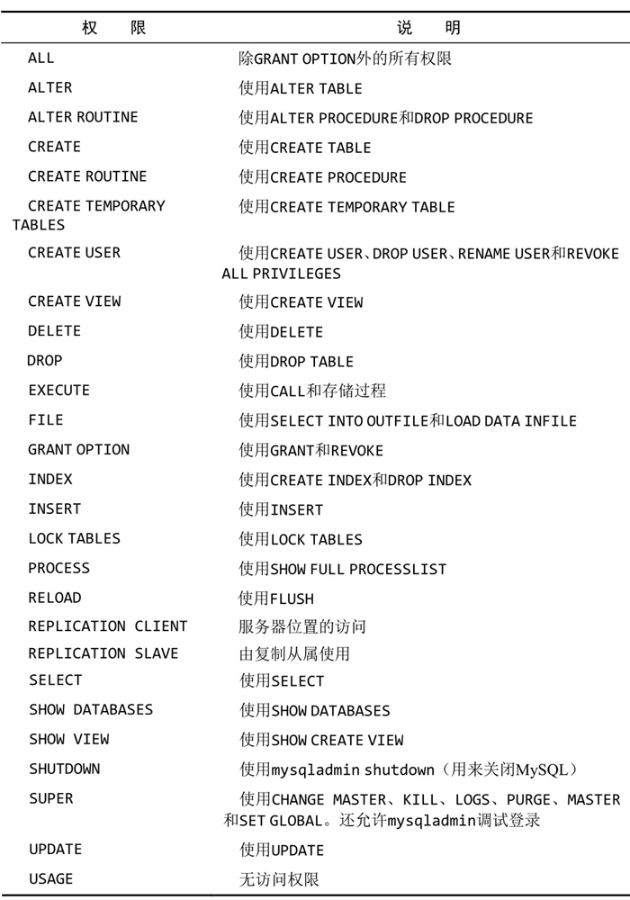

[TOC]

# MySQL

## 常用操作

### 基本操作

```sql
-- 查询数据库
SHOW DATABASES;

-- 指定数据库
USE databasename;

-- 查询表
SHOW TABLES;

-- 查询指定表列
SHOW COLUMNS FROM tablename;
DESCRIBE tablename;

-- 创建特定数据库、表、视图的语句
SHOW CREATE DATABASE databasename;
SHOW CREATE TABLE tablename;
SHOW CREATE VIEW viewname;

-- 解释如何执行SELECT语句
EXPLAIN SELECT语句
```

### 字符集

```sql
-- 查看字符集
SHOW CHARACTER SET;

-- 查看校对完整的列表，区分大小写_cs，不区分大小写_ci
SHOW COLLATION;

-- 获取系统的默认编码和校对
SHOW VARIABLES LIKE 'character%';
SHOW VARIABLES LIKE 'collation%';
```

> 可以对特定的表和列定义字符集和校对，或者在需要时使用备用的校对

### 函数

日期函数


数值函数


字符串函数


其他函数

1. ISNULL(exper)：判断exper是否为空，是则返回1，否则返回0
2. CAST(字段名 AS 转换的类型 )

## 数据库维护

### 运行状态

```sql
-- 服务器状态信息
SHOW STATUS;
-- 显示服务器错误/警告
SHOW ERRORS;
SHOW WARNINGS;

-- 查看表键是否正确
ANALYZE TABLE tablename;
-- 对表进行检查
CHECK TABLE tablename;
-- 删除大量数据后收回所用空间
OPTIMIZE TABLE tablename;

-- 显示所有活动线程
SHOW PROCESSLIST;
```

### 用户管理

```sql
-- 获取用户信息
USE mysql;
SELECT user FROM user;

-- 创建用户
CREATE USER username IDENTIFIED BY 'password';
-- 重命名账号
RENAME USER username TO new_username;
-- 删除用户账号
DROP USER username;
-- 更改用户口令
ALTER USER username IDENTIFIED BY 'password';

-- 查看账号的权限
SHOW GRANTS FOR username;

-- 赋予权限 1.授予的权限 2.被授予访问权限的数据库或表 3.用户名 权限具体看revoke图片
GRANT SELECT ON databasename.* TO username;
GRANT SELECT,INSERT ON databasename.* TO username;
-- 取消权限
REVOKE SELECT ON databasename.* FROM username;
```

权限列表



### 日志

- 备份（dump）
- 数据库维护
- 日志文件查看
    1. 错误日志（hostname.err）
    2. 查询日志（hostname.log）
    3. 二进制日志（hostname-bin）
    4. 缓慢查询日志（hostname-slow.log）

```sql
-- 查询日志路径 log_error、general_log_file、slow_query_log_file
SHOW VARIABLES LIKE 'log%';
-- 刷新、重新开始记录日志
FLUSH LOGS;
```
